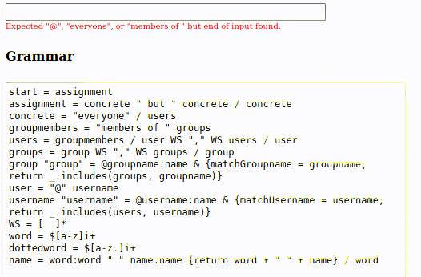

# PEGGY INPUT

An HTML input element that provides syntax directed editing and completion based on a [Peggy](https://peggyjs.org/) PEG grammar.



## Usage

Call `PeggyInput` with the jQuery input element and a javascript object with:

- grammar: A Peggy grammar with completion blocks for some of the rules.
- completers: A javascript object to use for matching completions.

The `completers` object contains subobjects that specified "completion rules".
A completion rule is a special rule with a Peggy `rule`, plus the completion `candidates`.
The Peggy grammar is expanded using the completers object.

Example:

```javascript
const users = ['Mariano Montone', 'Asgeir Bjørlykke', 'Martin Montone'];
const groups = ['Management', 'Administration', 'Human Resources'];

({
    'completers': {
       'username' : {
           'rule' : 'name',
           'candidates' : users
       },
       'group' : {
          'rule' : 'name',
          'candidates' : groups
       }
    }
})
```

That means two Peggy rules are added to the original grammar.
A `username` rule, that is parsed using the `name` rule.
And a `group` rule, that is also parsed using `name`.

The `candidates` contain an array of completion candidates.
A completion candidate should either a string, or an object with `label` and `value` members.
When one of those rules match, they are completed using the specified candidates.

### Options

- `grammar`: String. Required. The Peggy grammar.
- `completers`: Object. Required. Object with keys being the completer name, and value an object with `rule` and `candidates`. `rule` is the name of the Peggy rule to create.
- `showSyntaxErrorMsg`: Boolean. Optional. Default is `true`. When enabled show the syntax errors below the HTML input.
- `onChange`: Function. Optional. A function handler that is invoked with the PeggyInput instance as argument when there's a change.
- `errorMsgFormatter`. Function. Optional. A function that takes a PeggyInput instance and a Peggy SyntaxError and should return a string used a error message.
- `validateWhenBlank`: Boolean. Optional. Default is true iff the input is required. Whether to validate the input and show an error when the input is blank.
- `completionsCharCount`: Integer. Optional. Default is 0. The number of characters needed from the user to expand the list of completions candidates. Useful for when the number of completion candidates to filter out is big.
- `completionsAreaSize`: Integer. Optional. Number of elements to be shown in the completion area at a time. Default is 10. 
- `completionsAreaWidth`: Integer. Optional. Width of completions area, in pixels. Default is 400.

#### Completer object

- `rule` : The Peggy rule to match the completion.
- `candidates`: 
   * An array of strings.
   * An array of objects with `label` and `value` members.
   * A string with an url from where to `fetch` the candidates.
   * A function. Takes current entered prefix string and a PeggyInstance, and should return a Promise with a list of strings filtered by the prefix.
- `charCount`: Integer. Optional. Default is `completionsCharCount`. The number of characters needed from the user to expand the list of the completion's candidates.

### API

- `isValid`: Returns `true` iff the current input value is a valid expression according to the provided grammar.
- `getValue`: Returns the parsed value of the input, unless it is in an error state.
- `getError`: Returns the current syntax error.
- `getInput`: Access the HTML input element.

### User interface

A completion area `<select>` and an error message `<p>` elements are added beside the affected input.

Size of completions area can be controlled with `completionsAreaSize` and `completionsAreaWidth` options.

When the input is in an invalid state, it is marked as so, by adding an `error` class to it. Also, [setCustomValidity](https://developer.mozilla.org/en-US/docs/Web/API/HTMLObjectElement/setCustomValidity) is called on the input with the parser error message.

## Examples

### Assignments language

Edit a mini-language for assignments. There are users and groups of users.
The language has expressions like:
- everyone but @Peter
- members of Management but @John
- ...

Specify the Peggy grammar:

```javascript
start = assignment
assignmentgroup = "everyone" / groupmembers
assignment = g:assignmentgroup " " "but " as:assignees { return [g, {'not': as}] } / assignees
assignee = "everyone" / user / groupmembers
assignees = a:assignee WS "," WS as:assignees { return [a].concat(as) } / a:assignee { return [a] }
groupmembers = "members of " groups:groups { return {'membersOf':groups} }
groups = g:group WS "," WS gs:groups { return [g].concat(gs) } / g:group { return [g] }
user = "@" username:username { return {'user':username} }
WS = [ \t]*
word = !"but" cs:(![ ,@] .)+ { return cs.map(c => c[1]).join('') }
name = word:word " " name:name { return word + " " + name } / word
```

Create an HTML input element:

```html
<input id="input" type="text" style="width: 400px;"></input>
```

Instantiate a PeggyInput passing the grammar and completers as options:

```javascript
const users = ['Mariano Montone', 'Asgeir Bjorlykke', 'Martin Montone', 'Fernando Berretti'];
const groups = ['Management', 'Administration', 'Human Resources'];
PeggyInput('#input',
          {
              'grammar': grammar,
              'completers': {
                  'username' : {
                      'rule' : 'name',
                      'candidates' : users
                  },
                  'group' : {
                      'rule' : 'name',
                      'candidates' : groups
                  }
              }
          }
      );
```

## How it works

The algorithm is based on the following: try to parse the input using the given PEG grammar. When an error ocurrs, that error contains the expected input at point. The expected input is used to provide the completions.

## Development

`npm install`

Run `make`, `make clean`, `make rebuild`.

### Debug logs

`peggyInputInstance.logger.setLevel('debug');`

## Demo

`npm install`

Run `make start-demo`.
